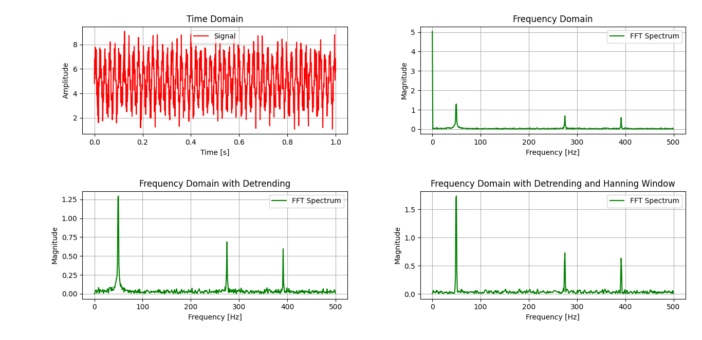

# Advanced Recursive FFT and Signal Analysis

This repository contains a comprehensive implementation of the Fast Fourier Transform (FFT) and a suite of signal pre-processing techniques. It demonstrates the transition from continuous-time signal theory to an efficient digital algorithm, incorporating methods to handle real-world sensor data.

## Table of Contents

- [Theoretical Foundation](#theoretical-foundation)
- [Digital Sampling and Constraints](#digital-sampling-and-constraints)
- [The Discrete Fourier Transform (DFT)](#the-discrete-fourier-transform-dft)
- [The FFT Algorithm](#the-fft-algorithm)
- [Signal Pre-processing Techniques](#signal-pre-processing-techniques)
- [Post-processing and Interpretation](#post-processing-and-interpretation)
- [Visual Analysis](#visual-analysis)

---

## Theoretical Foundation

Any physical signal can be represented mathematically as a sum of infinite sinusoids, each with specific frequencies, amplitudes, and phases. The **Continuous-Time Fourier Transform (CTFT)** provides the mechanism to decompose these signals:

$$X(\omega) = \int_{-\infty}^{\infty} x(t) \cdot e^{-i \cdot \omega \cdot t} \, dt$$

### Euler’s Formula and Correlation

The transformation relies on **Euler’s Formula** to represent circular motion in the complex plane:

$$e^{i\theta} = \cos(\theta) + i \cdot \sin(\theta)$$


Here, $\theta = \omega \cdot t$, and for one full circle, $\omega = 2 \cdot \pi \cdot f$, where $f$ is the frequency.

Substituting, we get:

$$e^{-i \cdot \omega \cdot t} = \cos(2 \cdot \pi \cdot f \cdot t) - i \cdot \sin(2 \cdot \pi \cdot f \cdot t)$$

When multiplying the signal $x(t)$ with this kernel inside the integral, we perform a cross-correlation. The real part ($\cos$) measures alignment with a cosine wave at frequency $f$, while the imaginary part ($\sin$) measures alignment with a sine wave at frequency $f$.

**Detailed Derivations:**

1. If frequency $f$ exists in the signal, the dot product $x(t) \cdot e^{-i 2 \pi f t}$ creates a non-zero area under the curve when integrated.
2. If frequency $f$ does not exist, oscillations cancel out, and the integral sums to zero.
3. The result $X(\omega)$ is a complex number.
4. Magnitude $|X(\omega)|$ represents strength.
5. Phase $\angle X(\omega)$ represents timing.

The inverse Fourier Transform is:

$$x(t) = \int_{-\infty}^{\infty} X(\omega) \cdot e^{i 2 \pi \omega t} \, d\omega$$

---

## Digital Sampling and Constraints

To process signals in a digital environment, the continuous function $x(t)$ must be converted into a discrete sequence $x[n]$.

* **Time Discretization**: Time is represented as $t = n \cdot T_s = \frac{n}{f_s}$, where $T_s$ is the sampling period and $f_s$ is the sampling frequency.
* **Nyquist-Shannon Constraint**: To prevent information loss (aliasing), the sampling frequency $f_s$ must be at least twice the highest frequency component $f_{\max}$ in the signal: $f_s \geq 2 f_{\max}$.

The Discrete-Time Fourier Transform (DTFT) is:

$$X(e^{i\omega}) = \sum_{n=-\infty}^{\infty} x[n] \cdot e^{-i \omega n}$$

Where $\omega = 2 \pi f / f_s$ is the normalized angular frequency. While the input is discrete, the output $X(e^{i\omega})$ is continuous in $\omega$.

---

## The Discrete Fourier Transform (DFT)

The DFT discretizes the frequency domain by dividing the $2\pi$ range into $N$ equal "bins":

$$X[k] = \sum_{n=0}^{N-1} x[n] \cdot e^{-i \frac{2\pi}{N} k n}$$

The term $e^{-i \frac{2\pi}{N} k n}$ is the **Twiddle Factor**, representing a unit circle divided into $N$ parts. As $n$ and $k$ increase, it simulates spinning around the complex plane to match the signal's rotation speed.

> **Computational Bottleneck**: For each of $N$ frequency bins, there are $N$ multiplications and additions, leading to $O(N^2)$ complexity.

---

## The FFT Algorithm

The FFT (Cooley-Tukey algorithm) uses a divide-and-conquer strategy, reducing complexity to $O(N \log N)$ by recursively splitting the input into even and odd samples.

### Mathematical Proof of the Split

Starting from the DFT:

$$X[k] = \sum_{n=0}^{N-1} x[n] \cdot e^{-i \frac{2\pi}{N} k n}$$

Split into even ($n = 2m$) and odd ($n = 2m+1$) indices:

$$X[k] = \sum_{m=0}^{N/2-1} x[2m] \cdot e^{-i \frac{2\pi}{N} k (2m)} + \sum_{m=0}^{N/2-1} x[2m+1] \cdot e^{-i \frac{2\pi}{N} k (2m+1)}$$

Simplify using the twiddle factor notation $W_N = e^{-i \frac{2\pi}{N}}$:

$$X[k] = \sum_{m=0}^{N/2-1} x[2m] \cdot W_{N/2}^{k m} + W_N^k \sum_{m=0}^{N/2-1} x[2m+1] \cdot W_{N/2}^{k m}$$

Let $E[k]$ be the FFT of even samples and $O[k]$ be the FFT of odd samples.

### The Butterfly Operation

Using symmetry ($W_N^{k + N/2} = -W_N^k$):

For $k < N/2$:
* $X[k] = E[k] + W_N^k \cdot O[k]$
* $X[k + N/2] = E[k] - W_N^k \cdot O[k]$


### Importance of Sample Size and Frequency Bins

In the FFT, the number of input samples $N$ must equal the number of output frequency bins. For the radix-2 Cooley-Tukey FFT, **$N$ must be a power of 2** (e.g., 2, 4, 8, 16...). This allows repeated halving of the array, enabling $\log_2(N)$ recursion levels.

### FFT Pseudocode

```text
FUNCTION FFT(data):
    N = length(data)
    IF N <= 1: RETURN data
    
    Even = FFT(data at even indices)
    Odd = FFT(data at odd indices)
    
    FOR k FROM 0 TO (N/2 - 1):
        Twiddle = exp(-i * 2 * PI * k / N)
        Result[k] = Even[k] + Twiddle * Odd[k]
        Result[k + N/2] = Even[k] - Twiddle * Odd[k]
        
    RETURN Result
```

---

## Signal Pre-processing Techniques

To improve accuracy when analyzing noisy or non-ideal sensor data, the following steps are implemented:

### 1. Detrending (DC Offset Removal)

Real-world signals often have a non-zero mean, known as a **DC Offset**. This creates a large spike at 0 Hz in the frequency domain, which can obscure small low-frequency components. 

Detrending is achieved by calculating the average value of the signal and subtracting it from every sample:

$$x_{detrended}[n] = x[n] - \frac{1}{N} \sum_{i=0}^{N-1} x[i]$$

### 2. Windowing (Hanning Method)

Real-world signals often have discontinuities at the boundaries of the sampling window, which causes **Spectral Leakage**. Windowing is used to smooth these transitions by gradually tapering the signal to zero at the edges.


#### Mathematical Definition

The Hanning window $w[n]$ tapers the signal using a cosine-based function:

$$w[n] = 0.5 \left( 1 - \cos\left( \frac{2\pi n}{N-1} \right) \right)$$

#### Application and Scaling

The time-domain signal is multiplied by the window before the FFT calculation:

$$x_{windowed}[n] = x[n] \cdot w[n]$$

Since windowing reduces the overall signal energy, the magnitudes are normalized by the sum of the window weights to maintain amplitude accuracy:

$$\text{Corrected Magnitude} = \frac{|X[k]|}{\sum w[n]} \times 2$$

---

## Post-processing and Interpretation

After computing the FFT, the raw complex numbers must be converted into physical magnitudes using the following steps:

| Step | Operation | Description |
| :--- | :--- | :--- |
| **Magnitude** | Absolute Value | Calculates the strength of each frequency by finding the magnitude of the complex result. |
| **Normalization** | Scaling | Divides by $N$ and multiplies by $2.0$ (except for 0 Hz) to restore true physical amplitudes. |
| **Frequency Mapping** | Bin to Hz | Maps each discrete index to its corresponding physical frequency using the sampling rate. |

---

## Visual Analysis

### Time Domain

The raw signal represents composite data from a DC Component, multiple oscillators, and random white noise.



---

### Frequency Domain Comparisons

* **Raw Spectrum**: Shows significant noise and a large DC spike at 0 Hz which dominates the scale.
* **Detrended Spectrum**: The 0 Hz spike is removed, allowing for better visualization of low-frequency components.
* **Windowed Spectrum**: Frequency peaks become narrower and more distinct. The "sidelobes" caused by spectral leakage are suppressed, revealing the true signal peaks from the noise floor.
